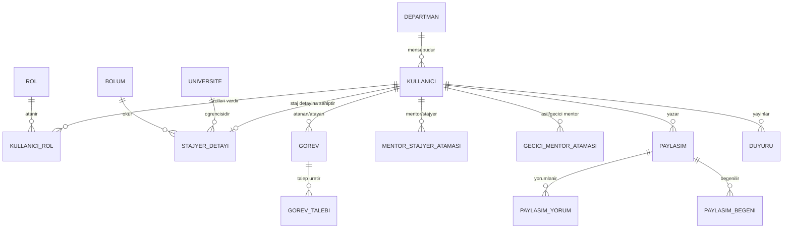
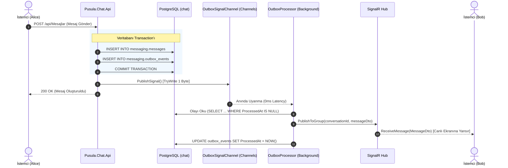
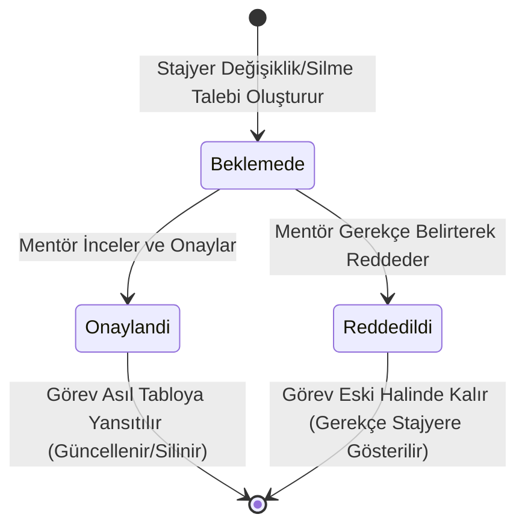

# SYSTRT & Pusula Ekosistemi — Kurumsal Stajyer Yönetimi ve Gerçek Zamanlı İletişim Platformu

<div align="center">


-512BD4?style=for-the-badge&logo=dotnet&logoColor=white)

-336791?style=for-the-badge&logo=postgresql&logoColor=white)


<p align="center">
  <b>Kurumsal Stajyer Süreçleri, Yetkilendirilmiş Görev Yönetimi, Otomatik Kilit Mekanizması ve Yüksek Ölçeklenebilir Gerçek Zamanlı Mesajlaşma Ekosistemi</b>
</p>

</div>

---

## 🔒 Kurumsal Gizlilik, Fikri Mülkiyet ve Kaynak Kodu Bildirimi (NDA Disclaimer)

> [!IMPORTANT]
> **ÖNEMLİ BİLGİLENDİRME:**
>
> 1. **Projenin Doğuşu ve Evrimi:** Bu proje, başlangıçta bağımsız bir çekirdek mimari ve kavram kanıtlama (PoC) prototipi olarak **SYSTRT** adıyla geliştirilmiştir. Çekirdek mimarinin başarısı üzerine proje; kurum içi standartlara, kurumsal güvenlik kurallarına ve **TRT Framework (v2)** altyapısına taşınarak **Pusula Ekosistemi** (`Pusula`, `Pusula.Chat` ve `Pusula.UI`) olarak production seviyesine ulaştırılmıştır.
>
> 2. **Gizlilik ve Kod Paylaşım Kısıtlaması:** Projenin nihai ve güncel sürümü; **TRT kurum içi tescilli NuGet paketlerini (`TRTFramework.Core`, `TRTFramework.Data`, `TRTFramework.Cache`), kurum içi ağ yapılandırmalarını ve tescilli kurumsal kütüphaneleri** içermektedir. Kurumsal bilgi güvenliği, fikri mülkiyet hakları ve Gizlilik Sözleşmesi (NDA) hükümleri uyarınca **kaynak kodların açık kaynaklı/harici platformlarda paylaşılması kesin olarak yasaktır.** Bu sebeple proje deposu **tamamen private (özel)** statüye alınmıştır.
>
> 3. **Bu Dokümanın Amacı:** İşbu `README.md` dosyası; projede uygulanan üst düzey yazılım mimarisini, veri tabanı tasarımını, mikroservis haberleşmesini, dağıtık sistem çözümlerini (Outbox Pattern, PostgreSQL Partitioning, System.Threading.Channels) ve iş kurallarını teknik değerlendiricilere eksiksiz sunmak amacıyla hazırlanmış kapsamlı bir **Teknik Mimari Raporu (Whitepaper)** niteliğindedir.
>
> 4. **Canlı Gösterim ve Sözlü Sunum:** Uygulamanın canlı çalışan arayüzleri, gerçek zamanlı soket davranışı, arka plan servislerinin işleyişi ve kod katmanları; **mülakat, teknik sunum ve yetkili heyet görüşmelerinde SÖZLÜ VE CANLI DEMO (Live Walkthrough) olarak sunulacaktır.**

---

## 📑 İçindekiler

1. [Ekosistemin Çözdüğü Kurumsal Problem](#-ekosistemin-cozdugu-kurumsal-problem)
2. [Üst Düzey Dağıtık Sistem Mimarisi](#-ust-duzey-dagitik-sistem-mimarisi)
3. [Tersine Proxy ve Ağ Yönlendirme (Nginx Gateway)](#-tersine-proxy-ve-ag-yonlendirme-nginx-gateway)
4. [Proje 1: Pusula (Çekirdek İş ve Yönetim API'si)](#-proje-1-pusula-cekirdek-is-ve-yonetim-apisi)
   - [Mimari Katmanlar](#mimari-katmanlar-clean-architecture)
   - [Varlık Kataloğu ve İlişkisel Şema](#varlik-katalogu-ve-iliskisel-sema)
   - [Kritik Servisler ve Kurumsal Kurallar](#kritik-servisler-ve-kurumsal-kurallar)
5. [Proje 2: Pusula.Chat (Gerçek Zamanlı Mesajlaşma Mikroservisi)](#-proje-2-pusulachat-gercek-zamanli-mesajlasma-mikroservisi)
   - [Neden Ayrık Servis?](#neden-ayrik-servis)
   - [Outbox Pattern ve System.Threading.Channels (0ms Gecikme)](#outbox-pattern-ve-systemthreadingchannels-0ms-gecikme)
   - [PostgreSQL Range Partitioning (Aylık Tablo Bölümleme)](#postgresql-range-partitioning-aylik-tablo-bolumleme)
   - [SignalR WebSocket Hub ve Soket Protokolü](#signalr-websocket-hub-ve-soket-protokolu)
   - [Hibrit Presence Service (Redis & InMemory)](#hibrit-presence-service-redis--inmemory)
6. [Proje 3: Pusula.UI (Modern Kurumsal Ön Yüz)](#-proje-3-pusulaui-modern-kurumsal-on-yuz)
   - [Teknoloji Yığını ve Tasarım Sistemi](#teknoloji-yigini-ve-tasarim-sistemi)
   - [Rol Tabanlı Portallar ve Sayfa Mimarisi](#rol-tabanli-portallar-ve-sayfa-mimarisi)
7. [Temel İş Mantıkları ve Durum Makineleri (State Machines)](#-temel-is-mantiklari-ve-durum-makineleri)
   - [A. İki Aşamalı Görev Değişiklik Talep/Onay Akışı](#a-iki-asamali-gorev-degisiklik-taleponay-akisi)
   - [B. Otomatik Staj Bitiş Kilidi (Saat 18:00 Kuralı)](#b-otomatik-staj-bitis-kilidi-saat-1800-kurali)
   - [C. Geçici Mentörlük (Delegated Mentorship) Devir Mekanizması](#c-gecici-mentorluk-delegated-mentorship-devir-mekanizmasi)
8. [Veri Bütünlüğü, Güvenlik ve Eşzamanlılık (Concurrency)](#-veri-butunlugu-guvenlik-ve-eszamanlilik)
9. [Kapsamlı API Uç Noktaları Sözleşmesi (Endpoints Catalog)](#-kapsamli-api-uc-noktalari-sozlesmesi)

---

## 🎯 Ekosistemin Çözdüğü Kurumsal Problem

Büyük ölçekli kurumlarda stajyer yönetimi ve mentörlük süreçleri genellikle şu kritik darboğazlarla karşılaşır:
- **Kontrolsüz Veri Girişi:** Stajyerlerin tamamlanmış veya mentör tarafından verilmiş kritik görevleri onay almadan değiştirmesi veya silmesi.
- **Staj Sonu Güvenlik Açığı:** Staj süresi biten öğrencilerin şirket sistemlerinde değişiklik yapmaya devam edebilmesi; geçmiş döneme ait verilerin denetim (audit) tutarlılığının bozulması.
- **İletişim Kopukluğu ve İzin Dönemleri:** Asıl mentörün yıllık izne veya sağlık raporuna ayrıldığı durumlarda stajyerin ortada kalması, görev onaylarının kilitlenmesi.
- **Mesajlaşma Yükü ve Veritabanı Şişmesi:** Klasik sohbet sistemlerinin veritabanı loglarını şişirmesi, soket yayınlarının HTTP thread'lerini tıkaması ve anlık çevrimiçi/çevrimdışı durumlarının dağınık olması.

**Pusula Ekosistemi**, bu problemleri enterprise seviyede çözmek için geliştirilmiş; iş süreçlerini kurallara bağlayan ve gerçek zamanlı iletişimi sıfır veri kaybı garantisiyle sunan bütünleşik bir platformdur.

---

## 🏛️ Üst Düzey Dağıtık Sistem Mimarisi

Sistem; **Clean Architecture** prensiplerine sıkı sıkıya bağlı, **CQRS** ile okuma/yazma ayrımı yapılmış, mikroservis ve modüler monolit hibrit modelinde kurgulanmıştır:

```mermaid
flowchart TB
    subgraph ClientLayer ["İstemci Katmanı (Client Layer)"]
        UI["Pusula.UI\n(React 19 + Tailwind v4 + Chakra UI v3)"]
    end

    subgraph GatewayLayer ["Tersine Proxy & Ağ Ağ Geçidi (Port 80)"]
        NGINX["Nginx Reverse Proxy Gateway"]
    end

    subgraph CoreService ["Pusula Servisi (:51771) - TRT Framework v2"]
        direction TB
        P_API["Pusula.Api (Controllers, Middlewares, Auth)"]
        P_APP["Pusula.Application (MediatR CQRS, Validators, Mapster)"]
        P_INFRA["Pusula.Infrastructure (EF Core UnitOfWork, Migrations, Seeds)"]
        P_DOM["Pusula.Domain (Entities, Enums, Specifications)"]
        P_API --> P_APP --> P_INFRA --> P_DOM
    end

    subgraph ChatService ["Pusula.Chat Servisi (:51772) - Realtime Microservice"]
        direction TB
        C_API["Pusula.Chat.Api (Mesajlar, InternalBroadcast)"]
        C_HUB["SignalR Hub (/hubs/messaging)"]
        C_APP["Pusula.Chat.Application (Message Handlers)"]
        C_OUTBOX["OutboxProcessor BackgroundService\n+ System.Threading.Channels (0ms)"]
        C_INFRA["Pusula.Chat.Infrastructure (ChatDbContext)"]
        C_API --> C_APP
        C_HUB --> C_APP
        C_APP --> C_INFRA
        C_OUTBOX --> C_INFRA
        C_OUTBOX --> C_HUB
    end

    subgraph StorageLayer ["Kalıcı Veri ve Dağıtık Önbellek Katmanı"]
        DB_PUSULA[("PostgreSQL: pusula\nKullanıcı, Görev, Talep, Paylaşım")]
        DB_CHAT[("PostgreSQL: chat\n(messaging.messages - Range Partitioned)")]
        REDIS[("Redis Cache Cluster\n(User Presence & Session Tokens)")]
    end

    UI -->|HTTP / REST| NGINX
    UI -->|WSS (WebSockets)| NGINX

    NGINX -->|/api/*| P_API
    NGINX -->|/api/Mesajlar*| C_API
    NGINX -->|/hubs/* (Upgrade: WebSocket)| C_HUB

    P_INFRA --> DB_PUSULA
    P_INFRA --> REDIS
    C_INFRA --> DB_CHAT
    C_INFRA --> REDIS
```

---

## 🌐 Tersine Proxy ve Ağ Yönlendirme (Nginx Gateway)

Tek bir kurumsal giriş kapısı üzerinden tüm mikroservis ve frontend istekleri yönlendirilir:

```nginx
# Kurumsal Nginx Yönlendirme Şeması
server {
    listen 80;
    server_name pusula.kurum.local;

    # 1. Frontend Tek Sayfa Uygulaması (SPA)
    location / {
        root   /usr/share/nginx/html;
        try_files $uri $uri/ /index.html;
    }

    # 2. SignalR WebSocket Yükseltmesi (Pusula.Chat)
    location /hubs/ {
        proxy_pass http://pusula-chat-api:8080;
        proxy_http_version 1.1;
        proxy_set_header Upgrade $http_upgrade;
        proxy_set_header Connection "Upgrade";
        proxy_set_header Host $host;
        proxy_cache_bypass $http_upgrade;
    }

    # 3. Mesajlaşma REST Uç Noktaları (Pusula.Chat)
    location /api/Mesajlar {
        proxy_pass http://pusula-chat-api:8080;
        proxy_set_header Host $host;
        proxy_set_header X-Real-IP $remote_addr;
    }

    # 4. Çekirdek Yönetim ve İş Süreçleri Uç Noktaları (Pusula)
    location /api/ {
        proxy_pass http://pusula-api:8080;
        proxy_set_header Host $host;
        proxy_set_header X-Real-IP $remote_addr;
    }
}
```

---

## 💼 Proje 1: Pusula (Çekirdek İş ve Yönetim API'si)

`Pusula`, .NET 10.0 ve TRT Framework v2 üzerinde inşa edilmiş, kurumun stajyer ekosistemini yöneten ana servis projesidir.

### Mimari Katmanlar (Clean Architecture)

```
Pusula/
├── src/
│   ├── Pusula.Domain/            # Saf POCO Domain modelleri, Enum'lar, kurallar (Dış bağımlılık: 0)
│   ├── Pusula.Contracts/         # DTO'lar, PagedResultDto<T>, Command/Query Request-Response modelleri
│   ├── Pusula.Application/       # MediatR Handler'ları, FluentValidation kuralları, Mapster profilleri
│   ├── Pusula.Infrastructure/    # EF Core PusulaDbContext (TRTFramework.Data.UnitOfWork), Migrations, Seeds
│   └── Pusula.Api/               # Controllers, Scalar UI OpenAPI konfigürasyonu, Global Exception Pipeline
```

### Varlık Kataloğu ve İlişkisel Şema

Aşağıdaki varlıklar, kurumsal veri tutarlılığı amacıyla `UnitOfWork` taban sınıfı üzerinden **Soft Delete** ve **PostgreSQL Row Versioning (`xmin`)** ile korunmaktadır:



1. **`Kullanici` & `Rol` & `KullaniciRol`**: Kimlik doğrulama, e-posta, hashlenmiş şifre, departman bağlantısı ve çoklu rol ataması.
2. **`StajyerDetayi`**: Üniversite, Bölüm, Staj Başlangıç/Bitiş Tarihi, Genel Kilit Durumu.
3. **`Gorev`**: Başlık, Açıklama, Öncelik (Düşük, Orta, Yüksek, Kritik), Durum (Bekliyor, Devam Ediyor, İncelemede, Tamamlandı), Teslim Tarihi, `AtayanMentorId`, `AtananStajyerId`.
4. **`GorevTalebi`**: Stajyerin bir görevi güncelleme veya silme isteğini mentör onayına sunan talep kaydı (`TalepTipi: Guncelleme/Silme`, `Durum: Beklemede/Onaylandi/Reddedildi`, `RedGerekcesi`).
5. **`MentorStajyerAtamasi`**: Asıl mentör-stajyer eşleşmesi.
6. **`GeciciMentorAtamasi`**: İzin ve rapor durumlarında belirli tarih aralığında geçerli geçici mentörlük sözleşmesi.
7. **`Paylasim`, `PaylasimYorum`, `PaylasimBegeni`**: Kurum içi teknik ve sosyal etkileşim duvarı.
8. **`Duyuru`**: Admin veya mentörler tarafından yayınlanan genel/departman bildirimleri.
9. **`HataLog`**: Sistemde oluşan tüm beklenmeyen istisnaların stack trace, kullanıcı kimliği ve istek yolu ile loglandığı merkezi tablo.

### Kritik Servisler ve Kurumsal Kurallar

- **`IStajyerKilitServisi`**: Stajyerin staj bitiş günü saat 18:00'de sistem tarafından otomatik kilitlenmesini sağlar. `ValidateStajyerKilitAsync`, `ValidateGorevKilitAsync` ve `ValidateGorevTalebiKilitAsync` metotları ile herhangi bir görev ekleme, güncelleme veya silme girişiminde anında `BTException` fırlatarak işlemi engeller.
- **`IJwtTokenGenerator`**: Kullanıcının rollerini, departman bilgisini ve kilit bayrağını barındıran güvenli JWT token üretir.
- **`ISystemOutboxPublisher`**: Kurum içi olayları `Pusula.Chat` mikroservisine ileten sözleşme.
- **Merkezi İstisna Yönetimi (RFC 7807 ProblemDetails):** `ValidationExceptionHandler` (FluentValidation doğrulama hatalarını 400 Bad Request olarak formatlar) ve `GlobalExceptionHandler` (tüm sunucu hatalarını güvenli hata formatına çevirir).

---

## ⚡ Proje 2: Pusula.Chat (Gerçek Zamanlı Mesajlaşma Mikroservisi)

### Neden Ayrık Servis?

Mesajlaşma trafiği doğası gereği yüksek eşzamanlılık (high concurrency), uzun ömürlü soket bağlantıları (persistent connections) ve devasa I/O gerektirir. Çekirdek yönetim API'sinin thread havuzunu tüketmemesi ve bağımsız ölçeklenebilmesi (scale out) amacıyla `Pusula.Chat` ayrı bir mikroservis olarak tasarlanmıştır.

### Outbox Pattern ve System.Threading.Channels (0ms Gecikme)

Klasik Outbox desenlerinde veritabanına yazılan olaylar, bir arka plan servisi tarafından her 2-5 saniyede bir `SELECT ... FOR UPDATE` ile sorgulanır. Bu durum hem veritabanını yorar hem de anlık sohbet için kabul edilemez bir gecikme (latency) yaratır.

**Pusula.Chat Çözümü:**
1. Mesaj ve `OutboxEvent`, aynı veritabanı transaction'ı içerisinde `ChatDbContext`'e yazılır ve commit edilir.
2. İşlem commit olduğu anda `IOutboxSignalChannel` üzerinden `_channel.Writer.TryWrite(0)` ile bellek içine 1 byte'lık hafif bir sinyal yazılır.
3. `OutboxProcessorBackgroundService`, `System.Threading.Channels` üzerindeki sinyali beklediği için **0 milisaniye gecikmeyle** uyanır.
4. Yeni outbox kaydı okunur, hedef kullanıcıların SignalR gruplarına yayınlanır ve `ProcessedAt` damgalanarak transaction kapatılır.



### PostgreSQL Range Partitioning (Aylık Tablo Bölümleme)

Kurumsal ölçekte mesaj tablosu hızla milyonlarca satıra ulaşır. Geleneksel indeksler şişer (B-Tree index bloat) ve sorgu süresi logaritmik olarak artar.

`Pusula.Chat`, PostgreSQL'in **Declarative Range Partitioning** özelliğini kullanır:
- `messaging.messages` ana tablosu `SentAt` (gönderim tarihi) kolonuna göre bölümlenmiştir.
- Her ay için fiziksel alt tablolar oluşturulur (`messages_y2026m07`, `messages_y2026m08` vb.).
- EF Core sorguları ana tabloya gönderir; PostgreSQL sorgu motoru **Partition Pruning** uygulayarak yalnızca ilgili aya ait alt tabloyu tarar. Bu sayede 100 milyon mesajda dahi sayfalama sorguları **< 5ms** altında döner.

```
                              [ messaging.messages ] (Partitioned Master Table)
                                               |
                     +-------------------------+-------------------------+
                     |                                                   |
           [messages_y2026m07]                                 [messages_y2026m08]
       (2026 Temmuz Mesajları)                             (2026 Ağustos Mesajları)
```

### SignalR WebSocket Hub ve Soket Protokolü

- **Hub Uç Noktası:** `/hubs/messaging`
- **Kimlik Doğrulama:** WebSocket el sıkışması esnasında HTTP Header gönderilemediği için JWT Token sorgu dizesi üzerinden alınır: `?access_token=...`

#### Hub Metotları & Soket Olayları:
| Olay / Metot Adı | Yön | Açıklama |
| :--- | :---: | :--- |
| `SendMessage` | Client ➔ Hub | Soket üzerinden doğrudan mesaj gönderimi |
| `JoinConversation` | Client ➔ Hub | Belirli bir sohbet odasına soket düzeyinde abone olma |
| `LeaveConversation` | Client ➔ Hub | Sohbet odası aboneliğinden ayrılma |
| `MarkAsRead` | Client ➔ Hub | Mesajı okundu olarak işaretleme |
| `ReceiveMessage` | Hub ➔ Client | Yeni gelen mesajın alıcı ekranında anında render edilmesi |
| `MessageStatusUpdated` | Hub ➔ Client | Mesaj durumunun güncellenmesi (Gönderildi ➔ İletildi ➔ Okundu / Mavi Tık) |
| `UserTyping` | Hub ➔ Client | Karşı tarafın yazıyor göstergesinin tetiklenmesi |
| `UserJoined` / `UserLeft` | Hub ➔ Client | Katılımcıların odaya katılım/ayrılış anlık bildirimi |

### Hibrit Presence Service (Redis & InMemory)

- **`RedisPresenceService`:** Dağıtık sunucu mimarisinde (multi-node) kullanıcı soket durumlarını Redis Set yapılarında saklar.
- **`InMemoryPresenceService`:** Bağımsız çalışma veya Redis kesintisi anlarında sıfır konfigürasyonla devreye giren bellek içi fallback sağlayıcısı.

---

## 🎨 Proje 3: Pusula.UI (Modern Kurumsal Ön Yüz)

### Teknoloji Yığını ve Tasarım Sistemi
- **Çatı:** React 19 + Vite (ESNext)
- **Stil & Tasarım:** TailwindCSS v4 + Chakra UI v3
- **İkonlar:** Lucide React & React Icons
- **Gerçek Zamanlı İstemci:** `@microsoft/signalr` v10
- **Yönlendirme (Routing):** `react-router-dom` v7 (`ProtectedRoute` ve `HomeRedirect` mekanizmaları)

### Rol Tabanlı Portallar ve Sayfa Mimarisi

```
src/pages/
├── Login.jsx                    # Kurumsal Giriş (JWT saklama ve rol ayrıştırma)
├── StajyerKayit.jsx             # Dinamik üniversite/bölüm seçimli kayıt formu
├── SifreDegis.jsx               # Güvenli şifre yenileme ekranı
│
├── admin/                       # 👑 Admin Portalı
│   ├── AdminKullanici.jsx       # Kullanıcı listesi, yetkilendirme, soft-delete
│   ├── AdminDepartman.jsx       # Departman hiyerarşisi yönetimi
│   ├── AdminUniversiteler.jsx   # Üniversite ana veri tanımları
│   └── AdminBolumler.jsx        # Mühendislik ve akademik bölüm yönetimi
│
├── mentor/                      # 👨‍🏫 Mentör Portalı
│   ├── MentorStajyerlerim.jsx   # Sorumlu olunan stajyerler ve durum takibi
│   ├── MentorStajyerHavuzu.jsx  # Havuzdaki sahipsiz stajyerleri üzerine alma
│   ├── MentorGorevTalep.jsx     # Stajyerlerin görev güncelleme/silme onayları
│   ├── MentorGeciciAtama.jsx    # İzin dönemlerinde stajyeri devretme paneli
│   ├── MentorMesaj.jsx          # Stajyerlerle anlık mesajlaşma ve dosya transferi
│   ├── MentorDuyurular.jsx      # Kurumsal duyuru yayınlama paneli
│   ├── MentorPaylasimlar.jsx    # Şirket içi teknik makale ve gönderi duvarı
│   └── MentorYardim.jsx         # Mentör iş akışı rehberi
│
└── stajyer/                     # 🎓 Stajyer Portalı
    ├── StajyerGorevleri.jsx     # Görev kartları, görev oluşturma, talep gönderme
    ├── StajyerMesajlar.jsx      # Mentörle anlık soru-cevap ve sohbet ekranı
    ├── StajyerPaylasimlar.jsx   # Deneyim paylaşımı, yorum yapma, beğenme
    ├── StajyerDuyurular.jsx     # Departman ve kurum duyurularını görüntüleme
    └── StajyerYardim.jsx        # Stajyer kuralları ve kilit bilgilendirmesi
```

---

## ⚙️ Temel İş Mantıkları ve Durum Makineleri

### A. İki Aşamalı Görev Değişiklik Talep/Onay Akışı

Stajyerlerin kendi görevlerini doğrudan güncelleyip silememesi, kurum içi denetim güvenliğini garanti altına alır:



- **Zorunlu Gerekçe Kuralı:** Mentör talebi reddettiğinde sistem boş bir red gerekçesini kabul etmez (`ValidationException`). Stajyer, mentörün yazdığı gerekçeyi panosunda anında görür.

### B. Otomatik Staj Bitiş Kilidi (Saat 18:00 Kuralı)

```
                       [ Staj Bitiş Tarihi Günü ]
                                  |
               08:00 ---------------------------> 18:00
               [ Normal Çalışma ]           [ SİSTEM KİLİTLENİR ]
                                                      |
                                      +---------------+---------------+
                                      |                               |
                                [ Arayüz Modu ]                 [ API Modu ]
                           Formlar pasife alınır.           IStajyerKilitServisi
                          Salt-Okunur Rozeti çıkar.       Tüm mutasyonları 400 ile keser.
```

- Stajyer sisteme giriş yapmaya devam edebilir; portfolyosunu ve mentör notlarını görebilir ancak hiçbir veri üzerinde değişiklik yapamaz.

### C. Geçici Mentörlük (Delegated Mentorship) Devir Mekanizması

- Bir mentör izne ayrılacağı zaman sistem üzerinden tarih aralığı belirleyerek stajyerini başka bir mentöre devreder.
- Devir süresi boyunca geçici mentör; stajyerin görevlerini onaylayabilir, yeni görev atayabilir ve soket üzerinden stajyerle mesajlaşabilir.
- Süre dolduğunda geçici yetkiler arka planda otomatik olarak sona erer.

---

## 🛡️ Veri Bütünlüğü, Güvenlik ve Eşzamanlılık

1. **İyimser Eşzamanlılık Denetimi (Optimistic Concurrency Control):**
   - EF Core üzerinde `modelBuilder.ApplyPostgresRowVersion()` kullanılarak PostgreSQL'in yerel `xmin` sistem kolonu eşzamanlılık belirteci (concurrency token) olarak atanmıştır. İki mentör aynı anda aynı kaydı güncellemeye çalıştığında `DbUpdateConcurrencyException` fırlatılarak veri ezilmesi engellenir.
2. **Yumuşak Silme (Soft Delete):**
   - Tüm varlıklar `IsDeleted` ve `DeletedAt` alanlarına sahiptir. Silinen kayıtlar veritabanından yok edilmez; global sorgu filtreleri (`HasQueryFilter`) sayesinde tüm `SELECT` sorgularında otomatik filtrelenir.
3. **Denetim İzi (Audit Trail):**
   - Her kayıtta `CreatedAt`, `CreatedBy`, `UpdatedAt`, `UpdatedBy` alanları `UnitOfWork` katmanında `ICurrentUserAccessor` kullanılarak otomatik doldurulur.
4. **Hassas Veri Koruması:**
   - Parolalar endüstri standardı tuzlanmış algoritmalarla hashlenir; e-posta ve telefon bilgileri kişisel veri güvenliği politikalarına uygun işlenir.

---

## 📡 Kapsamlı API Uç Noktaları Sözleşmesi

### 1. Pusula.Api (Yönetim Servisi — Port 51771)

| Controller | HTTP Metodu | Route | İzin Verilen Roller | İşlev |
| :--- | :---: | :--- | :---: | :--- |
| **Auth** | `POST` | `/api/Auth/login` | Herkese Açık | E-posta/şifre ile giriş ve JWT Token temini |
| **Auth** | `POST` | `/api/Auth/register-stajyer` | Herkese Açık | Yeni stajyer kaydı |
| **Auth** | `GET` | `/api/Auth/me` | Giriş Yapmış | Mevcut profil, roller ve kilit durumunu döner |
| **Kullanicilar** | `GET` | `/api/Kullanicilar` | Admin, Mentör | Kullanıcı listesi filtreleme |
| **Kullanicilar** | `DELETE` | `/api/Kullanicilar/{id}` | Admin | Kullanıcıyı güvenli silme (Soft-delete) |
| **Gorevler** | `GET` | `/api/Gorevler` | Giriş Yapmış | Görevleri durum/öncelik bazlı listeleme |
| **Gorevler** | `POST` | `/api/Gorevler` | Giriş Yapmış | Yeni görev tanımlama |
| **GorevTalepleri** | `POST` | `/api/GorevTalepleri` | Stajyer | Görev güncelleme/silme onayı talep etme |
| **GorevTalepleri** | `POST` | `/api/GorevTalepleri/{id}/approve` | Admin, Mentör | Talebi kabul edip göreve yansıtma |
| **GorevTalepleri** | `POST` | `/api/GorevTalepleri/{id}/reject` | Admin, Mentör | Gerekçe ile talebi reddetme |
| **Atamalar** | `GET` | `/api/MentorStajyerAtamalari/havuz`| Admin, Mentör | Atama bekleyen stajyer havuzunu getirme |
| **Atamalar** | `POST` | `/api/MentorStajyerAtamalari` | Admin, Mentör | Stajyeri mentöre zimmetleme |
| **GeciciAtama** | `POST` | `/api/GeciciMentorAtamalari` | Mentör | Geçici devir talebi başlatma |
| **Paylasimlar** | `POST` | `/api/Paylasimlar` | Giriş Yapmış | Şirket içi gönderi paylaşma |
| **Paylasimlar** | `POST` | `/api/Paylasimlar/{id}/yorum` | Giriş Yapmış | Gönderiye yorum ekleme |
| **Duyurular** | `POST` | `/api/Duyurular` | Admin, Mentör | Kurumsal duyuru yayınlama |

### 2. Pusula.Chat.Api (Mesajlaşma Servisi — Port 51772)

| Controller | HTTP Metodu | Route | İzin Verilen Roller | İşlev |
| :--- | :---: | :--- | :---: | :--- |
| **Mesajlar** | `GET` | `/api/Mesajlar/conversation/{sId}/{mId}` | Giriş Yapmış | Birebir sohbet geçmişi (Sayfalı) |
| **Mesajlar** | `POST` | `/api/Mesajlar` | Giriş Yapmış | Mesaj gönder (Outbox kaydı tetikler) |
| **Mesajlar** | `POST` | `/api/Mesajlar/grup` | Giriş Yapmış | Yeni grup sohbet odası oluşturma |
| **Mesajlar** | `GET` | `/api/Mesajlar/gruplarim` | Giriş Yapmış | Dahil olunan grupları getirme |
| **Mesajlar** | `POST` | `/api/Mesajlar/{id}/read` | Giriş Yapmış | Mesajı okundu işaretle (Soket tetikler) |
| **Mesajlar** | `GET` | `/api/Mesajlar/is-online/{userId}` | Giriş Yapmış | Anlık çevrimiçi durumunu sorgulama |

---

<div align="center">
  <sub>Bu doküman, kurum içi TRT Framework v2 kurallarına ve yazılım mimarisi standartlarına uygun olarak titizlikle hazırlanmıştır.</sub>
</div>
